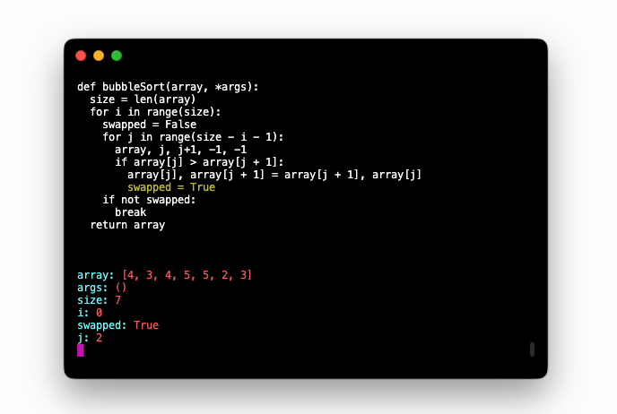

<br/>
<div align=center>




</div>

## Installation

```bash
pip install stepbystep
```

## Usage

### 1. Copy the snippet which you want to analyze into a separate file.

### 2. Add the decorator to your function.

To inspect your snippet step by step, you should surround your snippet with `@stepbystep_wrapper` decorator.

> You should specify the time intervals between steps in seconds using the `time_between_steps` argument

```python

```python
from stepbystep import stepbystep_wrapper

@stepbystep_wrapper(time_between_steps=0.5)
def bubbleSort(array, *args):
  size = len(array)
  for i in range(size):
    swapped = False
    for j in range(size - i - 1):
      array, j, j+1, -1, -1
      if array[j] > array[j + 1]:
        array[j], array[j + 1] = array[j + 1], array[j]
        swapped = True
    if not swapped:
      break
  return array
```

### 3. Run the script

```bash
python my_snippet.py
```

That's it. Now you can run your script and enjoy the magic!